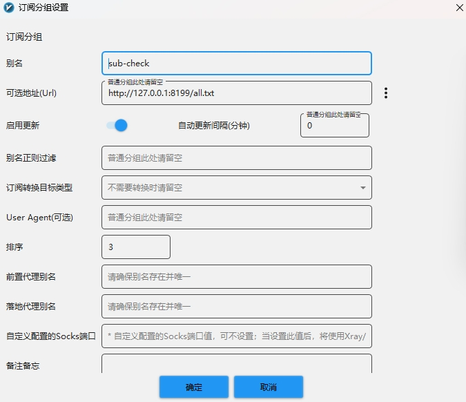
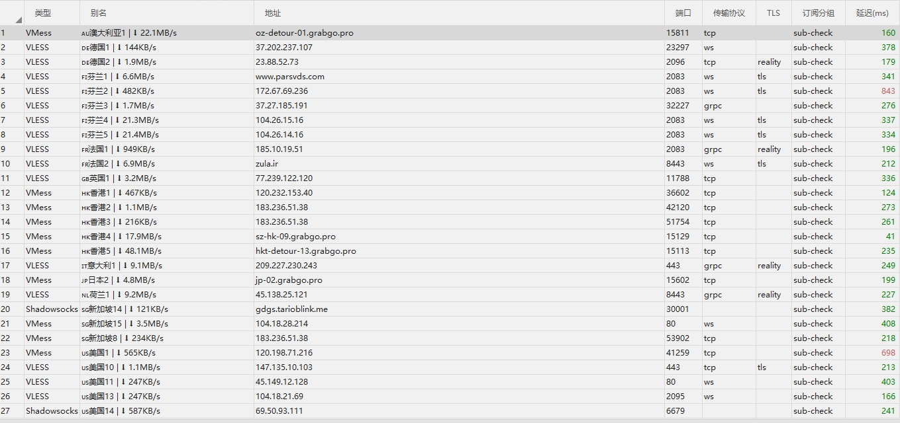

# 订阅合并转换检测工具

对比原项目是修复了一些逻辑、简化了一些东西、增加了一些功能

**请尽快升级至v1.1.0+，大幅减少内存占用！！**

## 预览


## 功能

- 检测节点可用性,去除不可用节点
  - 新增参数`keep-success-proxies`用于持久保存测试成功的节点，可避免上游链接更新导致可用节点丢失，此功能默认关闭
- ~~检测平台解锁情况~~ 暂时注释了，因为我觉得没啥用
    - ~~openai~~
    - ~~youtube~~
    - ~~netflix~~
    - ~~disney~~
- 合并多个订阅
- 将订阅转换为clash/mihomo/base64格式
- 节点去重
- 节点重命名
- 节点测速（单线程）
- 根据解锁情况分类保存
- 支持外部拉取结果（默认监听 :8199）
- 支持100+ 个通知渠道 通知检测结果

## 特点

- 支持多平台
- 支持多线程
- 资源占用低

## TODO

- [x] 适配多种订阅格式
- [ ] 支持更多的保存方式
    - [x] 本地
    - [x] cloudflare r2
    - [x] gist
    - [x] webdav
    - [x] http server
    - [ ] 其他
- [ ] 已知从clash格式转base64时vmess节点会丢失。因为太麻烦了，我不想处理了。
- [ ] 可能在某些平台、某些环境下长时间运行还是会有内存溢出的问题

## 测速使用方法
> 如果拉取订阅速度慢，可使用通用的 `HTTP_PROXY` `HTTPS_PROXY` 环境变量加快速度；此变量不会影响节点测试速度

> 因为上游订阅链接可能是爬虫，所以本地可用的节点经常被刷新掉，所以可以使用 `keep-success-proxies` 参数持久保存测试成功的节点
> 此参数默认关闭。并且会将数据临时存放到内存中，如果可用节点数量非常多，请不要打开此参数（因为可能会占用一点内存）。可将生成的链接添加到测试链接当中一样可以实现此效果

### 自建测速地址（可选）
> 尽量不要使用Speedtest，Cloudflare提供的下载链接，因为很多节点屏蔽测速网站
1. 将 [worker.js](./doc/cloudflare/worker.js) 部署到 Cloudflare Workers
2. 绑定自定义域名（目的是为了不被节点屏蔽）
3. 将 speed-test-url 配置为你的 worker自定义域名地址
```bash
# 100MB
speed-test-url: https://custom-domain/speedtest?bytes=104857600
# 1GB
speed-test-url: https://custom-domain/speedtest?bytes=1073741824
```
### docker运行

```bash
docker run -d --name subs-check -p 8199:8199 -v ./config:/app/config  -v ./output:/app/output --restart always ghcr.io/beck-8/subs-check:latest
```
```bash
# 如果想使用代理，加上环境变量，如
docker run -d --name subs-check -p 8199:8199  -e HTTP_PROXY=http://192.168.1.1:7890 -e HTTPS_PROXY=http://192.168.1.1:7890 -v ./config:/app/config  -v ./output:/app/output --restart always ghcr.io/beck-8/subs-check:latest
```

### docker-compose

```yaml
version: "3"
services:
  mihomo-check:
    image: ghcr.io/beck-8/subs-check:latest
    container_name: subs-check
    volumes:
      - ./config:/app/config
      - ./output:/app/output
    ports:
      - "8199:8199"
    environment:
      - TZ=Asia/Shanghai
      # 是否使用代理
      # - HTTP_PROXY=http://192.168.1.1:7890
      # - HTTPS_PROXY=http://192.168.1.1:7890
    restart: always
    tty: true
    network_mode: bridge
```
### 源码直接运行

```bash
go run main.go -f /path/to/config.yaml
```

### 二进制文件运行

直接运行即可,会在当前目录生成配置文件

## 通知渠道配置方法
目前，此项目使用[Apprise](https://github.com/caronc/apprise)发送通知，并支持 100+ 个通知渠道。  
但是 apprise 库是用 Python 编写的，Cloudflare 最近发布的 python worker在部署 apprise 时仍然存在问题  
所以我们下边提供两种部署方式的教程（当然实际不止两种）
### Vercel serverless 部署
1. 请单击[**此处**](https://vercel.com/new/clone?repository-url=https://github.com/beck-8/apprise_vercel)即可在您的 Vercel 帐户上部署 Apprise  
2. 部署后，您将获得一个类似 `https://testapprise-beck8s-projects.vercel.app/` 的链接，在其后附加`/notify` ，然后您将获得 Apprise API 服务器的链接： `https://testapprise-beck8s-projects.vercel.app/notify`
3. 请将你的Vercel项目添加一个自定义域名，因为Vercel在国内几乎访问不了

### docker部署
```bash
docker run --name apprise -p 8000:8000 --restart always -d caronc/apprise:latest
```
```bash
# 如果你将docker部署在国内，你还想要发送到国外的平台，那需要添加 HTTP_PROXY HTTPS_PROXY 环境变量
docker run --name apprise \
   -p 8000:8000 \
   -e HTTP_PROXY=http://192.168.1.1:7890 \
   -e HTTPS_PROXY=http://192.168.1.1:7890 \
   --restart always \
   -d caronc/apprise:latest
```

然后根据[Apprise wiki](https://github.com/caronc/apprise/wiki)编写发送通知的 URL，其中有关于如何设置每个通知渠道的详细文档和说明。例如，对于电报，您的 URL 是`tgram://botToken/chatId`，我在默认配置里边写了一些示例，可以当作参考

## 保存方法配置

- 本地保存: 将结果保存到本地,默认保存到可执行文件目录下的 output 文件夹
- r2: 将结果保存到 cloudflare r2 存储桶 [配置方法](./doc/r2.md)
- gist: 将结果保存到 github gist [配置方法](./doc/gist.md)
- webdav: 将结果保存到 webdav 服务器 [配置方法](./doc/webdav.md)

## 对外提供服务配置
- `http://127.0.0.1:8199/all.yaml` 返回yaml格式节点
- `http://127.0.0.1:8199/all.txt` 返回base64格式节点

可以直接将base64格式订阅放到V2rayN中或者Mihomo party当中



## 订阅使用方法

推荐直接裸核运行 tun 模式 

原作者写的Windows下的裸核运行应用 [minihomo](https://github.com/bestruirui/minihomo)

- 下载[base.yaml](./doc/base.yaml)
- 将文件中对应的链接改为自己的即可

例如:

```yaml
proxy-providers:
  ProviderALL:
    url: https:// #将此处替换为自己的链接
    type: http
    interval: 600
    proxy: DIRECT
    health-check:
      enable: true
      url: http://www.google.com/generate_204
      interval: 60
    path: ./proxy_provider/ALL.yaml
```